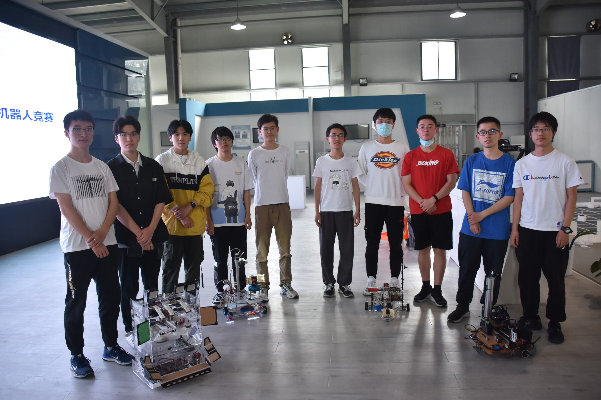

# 一些图片

设计图：

校赛合影（队员为陈烨柯（右二）、余味（右一）、公冶在田（走了））：

# 上位机文件夹upper使用说明：

1. yolov5文件夹内的文件放到 github上下载的yolov5文件夹中，其中pt模型换成自己的模型。当时是根据yolov5的某版本写的，torch版本1.10.0，torchvision 0.11.0a0。如果要其他版本，记得自行修改相应的地方。（好像找不到是哪个版本了，就顺便传上来github上yolov5的代码，在yolov5-from-github文件夹里，其中check_requirements函数被我注释掉了。）
2. 运行的时候用`sudo python detect_new.py`命令。
3. cam文件夹里是一些简单的相机功能，其中take_pic_period不需要开桌面，cam_video show_cam都需要开桌面
4. jetson nano csi相机的使用需要研究研究，可以参考[这篇文章](http://t.csdn.cn/CpoKG)，opencv 4.5.5亲测可以。

# 下位机文件夹lower使用说明：
1. 烧录到arduino mega

