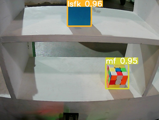
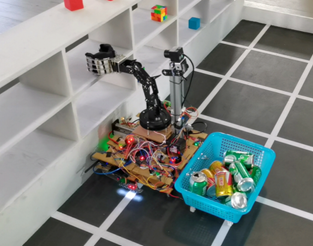

**Read this in other languages: [English](README.md), [中文](README_zh.md).**

# Introduction

This is a **competition project** that requires you to walk through a rectangular simulated supermarket with white lines on a black background within a specified time to grab the goods you need, and the shelves will contain distractions. 

The robot of this project uses a usb industrial camera to collect images, and uses yolov5 to detect items on the upper computer jetson nano, which can achieve 10+ frame rate. The robot uses grayscale sensors for line following, and uses DC gear motors with AB two-phase incremental photoelectric rotary encoders , which is controlled through pid. The simple mechanical arm is used as the grasping mechanism, and the stepper motor controller as well as a screw guide are used as the linear mechanism (to increase the grasping range of the mechanical arm). Electromagnets and permanent magnets are used to connect the robot body to the shopping cart.

Design drawing:

Detection result:

Photo of the robot:

Photo of the winning team(Second from right is me) :

# Usage of ‘Upper’

1. torch 1.10.0，torchvision 0.11.0a0
2. run the command`sudo python detect_new.py`

# Usage of ‘Lower’

1. Compile them and download it to arduino mega
